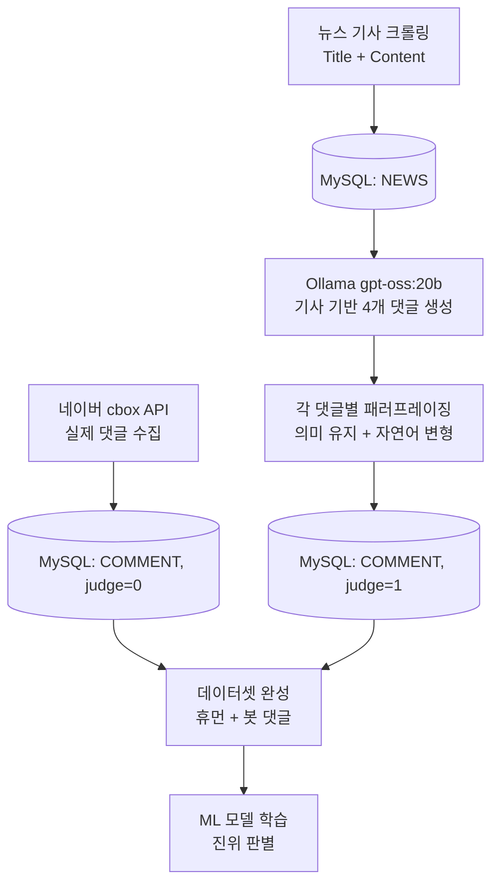

# 뉴스 댓글 생성 및 진위 판별 모델 연구 프로젝트

본 프로젝트는 **네이버 뉴스 댓글 데이터를 기반으로, 댓글이 인간(휴먼)이 작성한 것인지 자동 생성(봇)된 것인지 판별하는 머신러닝 모델**을 개발하는 것을 목표로 합니다.  
실제 사용자 댓글(인간 데이터)과 Ollama 기반 LLM으로 생성한 봇 댓글을 수집·생성하여 비교 학습용 데이터셋을 구축합니다.

---

## 프로젝트 개요

- **목표**: 인간/봇 댓글 분류 모델 개발
- **데이터 소스**:
  - **인간 댓글 `5515개`**: 네이버 공식 댓글 API (`cbox`) 수집 
  - **봇 댓글 `1909개`**: Ollama `gpt-oss:20b` 모델로 기사 기반 생성 + 패러프레이징 
- **최종 산출물**: `judge` 레이블 포함 데이터셋 → 머신러닝 모델 학습

---

## 기술 스택
| Category    | Technology              |
|-------------|-------------------------|
| `언어` | Python 3.10                  |
| `LLM`     | Ollama `(gpt-oss:20b)`    |
| `DB`   | MySQL + SQLAlchemy (ORM)     |
| `크롤링`     | Requests, BeautifulSou |

--- 

## 데이터베이스 스키마

### `NEWS` 테이블 (기사 정보)
| Column   | Type      | Description       |
|----------|-----------|-------------------|
| `newID`  | INT PK    | 뉴스 식별 ID      |
| `Title`  | LONGTEXT  | 기사 제목         |
| `Content`| LONGTEXT  | 기사 본문 내용    |

### `COMMENT` 테이블 (댓글 정보)
| Column      | Type      | Description                          |
|-------------|-----------|--------------------------------------|
| `commentID` | INT PK    | 댓글 식별 ID                         |
| `newID`     | INT FK    | 연결된 뉴스 ID (`NEWS.newID`)        |
| `comment`   | LONGTEXT  | 댓글 내용                            |
| `judge`     | INT       | 0 = 휴먼 댓글, 1 = 봇 댓글 (레이블)   |

---

## 전체 데이터 파이프라인



## 주요 기능 및 구현
### 1. 뉴스 기사 수집

- 네이버 뉴스 섹션 URL 수집
- BeautifulSoup + Requests로 제목 + 본문 크롤링
- SQLAlchemy로 NEWS 테이블 저장

### 2. 실 사용자 댓글 수집
- 네이버 공식 cbox API 사용
- moreParam.next 페이징 처리로 다중 페이지 로딩
- judge=0으로 COMMENT 테이블 저장

### 3. 봇 댓글 생성 (gpt-oss:20b)
   import ollama

```python
def generate_comment(article):
    prompt = f"""
    다음 기사 제목과 본문을 참고하여 자연스럽고 공감 가능한 댓글을 4개 작성,
    댓글의 길이는 최대 100 최소 40 길이로 다양하게 작성, 특수기호 사용 금지.
    제목: {article['title']}
    본문: {article['content']}
    """
    response = ollama.chat(
        model="gpt-oss:20b",
        messages=[{"role": "user", "content": prompt}]
    )
    return response["message"]["content"].strip()
```

### 4. 패러프레이징 (자연스러움 + 다양성 확보)
```python
def paraphrase_comment(comment_text):
    prompt = f"""
    다음 댓글을 자연스럽게 바꾸되, 의미는 유지하세요.
    길이는 최대 100자, 최소 40자로 다양하게 작성하고, 특수기호 사용 금지:
    댓글: {comment_text}
    """
    response = ollama.chat(
        model="gpt-oss:20b",
        messages=[{"role": "user", "content": prompt}]
    )
    return response["message"]["content"].strip()
```
- 각 생성 댓글 → 1회 이상 패러프레이징
- 의미 유지 여부 및 자연스러움 검증 후 저장

| 원본 댓글 | 패러프레이징된 댓글 |
|-----------|----------------------|
| 정당한 조사를 기대합니다. 군 인력 절감이 아닌 정당한 수사라는 점이 중요해요.  | 정당한 조사를 기대하며, 군 인력 절감이 아니라 실제 수사에 중점을 두는 점이 중요합니다. | 
| 저는 홍 전 시장이 말한 탈출이 정말 필요했던 순간이라고 생각해요  | 저는 홍 전 시장이 말한 탈출이 그때 정말 필요했던 순간이라고 생각해요  |

### 5. 데이터 저장
- 생성/패러프레이징 댓글 → judge=1로 저장
- judge 필드를 분류 모델의 정답 레이블로 사용


---
## 데이터 수집 실행 순서

- 뉴스 기사 수집 → NEWS 저장
- 실제 댓글 수집 → COMMENT (judge=0)
- 봇 댓글 생성 (4개/기사)
- 패러프레이징 수행
- 봇 댓글 저장 (judge=1)
- 데이터셋 완성 → ML 학습 준비

## 데이터셋 샘플
### `news` 테이블
| newID   | Title      | Content       |
|----------|-----------|-------------------|
| 3  | 정부, 암표에 칼 빼든다…"과징금 최대 30배, 신고자에겐 포상금"    | 7일 잠실야구장에서 열리는 2025KBO리그 LG트윈스와 SSG`생략`  |
| 13  | 나경원, 라디오 생방서 진행자에 "정성호 대변인이냐" 발끈  | "檢 대장동 항소 포기는 외압…정 장관 입장은 `생략` |

### `comment` 테이블
|commentID|newID|comment|judge|
|-|--|-------------------|-|
|3082|3|저는 암표가 흔한 사회 문제라서 이번 정부 정책에 희망을 느꼈어요 그리고 앞으로도 입장권 가격이 상승해도 차라리 정가를 지켜야 할 것 같아요|1|
|3832|3|정부가 암표를 잡는 방식이 과징금에 집중하는 점이 인상적이네요 하지만 신고자 포상도 꼭 필요하다고 생각해요|1|
|100|13|나경원은 항상 논리가 딸리니까 마지막은 꼭 인신공격이지. 나경원이 국힘을 대표하고 나서는 시기 동안 국힘이 잘 된 적이 없다|0|
|113|13|제2의 홍준표납시었네.. 진행자가 먼질문이든 할수 있고, 대답자신없으면 모른다고 하면 될일이지, 진행자를 공격하는 치사한짓을 하냐? 달을 봐야지 손가락을 지적질해대면 되것냐? 5선씩이나 된담서.. 초선같은짓을 하다니...|0|

---
# Sentence-BERT 임베딩 적용 개요
## [데이터 구성](https://github.com/RealSan1/Machine-Learning-for-Bot-Detection/blob/main/dataProcessing/commentData.csv)
원본 CSV 파일에는 다음 컬럼이 포함되어 있습니다:  
- 뉴스제목 (title)
- 뉴스내용 (content)
- 댓글 (comment)
- 봇판단 (is_bot, 0: 휴면댓글, 1: 봇댓글)

## 임베딩 과정
1. 뉴스제목, 뉴스내용, 댓글 텍스트를 결합하여 하나의 문장 단위 텍스트 생성  
2. 한국어에 최적화된 Sentence-BERT 모델(`snunlp/KR-SBERT-V40K-klueNLI-augSTS`)을 사용해 문장 임베딩 생성  
3. 각 텍스트별 768차원 벡터를 추출  
4. 임베딩 벡터와 봇판단 레이블을 별도로 저장하여 학습 데이터로 활용

## 특징 및 장점
- 문맥과 문장 의미를 반영한 임베딩으로 단어 평균 방식 대비 표현력 향상  
- 뉴스와 댓글을 통합한 문장 임베딩으로 댓글 맥락 파악 가능  
- 봇판단 분류 모델 성능 향상에 기여

## 활용
- 저장된 Sentence-BERT 임베딩 벡터와 레이블을 기반으로 머신러닝/딥러닝 모델 학습  
- 봇 탐지 모델의 입력 특징(feature)으로 활용되어 정확도 및 재현율 개선 기대
---
